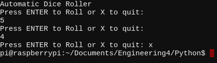
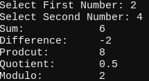
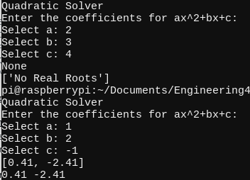
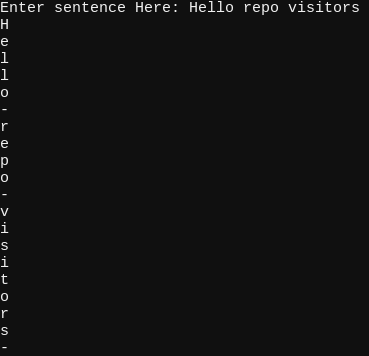
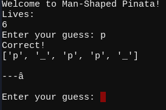

# Engineering4
My Engineering 4 work

# Table of Contents
* [Pi Online](#Pi-Online)
* [Hello Python/Dice Roller](#Hello-Python/Dice-Roller)
* [Program 01 Calculator](#Program-01-Calculator)
* [Program 02 Quadratic Solver](#Program-02-Quadratic-Solver)
* [Program 03 Strings and Loops](#Program-03-Strings-and-Loops)
* [Challenge Man Shaped Piñata](#Challenge-Man-Shaped-Piñata)

## Pi Online
In this assignment I was tasked with connecting my raspberry pi to the internet. My pi wouldn't connect to the wifi at my house but I did manage to connect it to my personal hotspot. I had to take the space out of the name of my phone and it took a few tries before it actually connected. I couldn't find any reason for it to not be connecting so I just kept trying and eventually it connected.

## Hello Python/Dice Roller
### Description
This assignment is from the Hello Python module. In this assignment we had to create a python file that would roll a die when enter was pressed and when x was pressed the program would quit.
### Code
```python
#Automatic Dice Roller
#Written by Imogen A

from random import randint
import time
import sys

min = 1 #minimum number that you can get
max = 6 #maximum number that you can get

print ("Automatic Dice Roller") #Set up/title

while True:
        time.sleep(1) #delay so it doesn't get overwhelmed
        RollPrompt = input("Press ENTER to Roll or X to quit: ") #asking for input

        if RollPrompt == (""): #if enter is pressed
                print(randint(min,max)) #print a number between 1 and 6
        if RollPrompt == ("x"): #if x is pressed
                sys.exit() #ends the program
```
### Images


### Reflection
I struggled with this assignment in the beginning because I didn't know how I would be able to press enter and get feedback. However after I figured it out it out the rest of the code was easy.

## Program 01 Calculator
### Description
In this module, we had to make a calculator in python. We had to have the user input 2 numbers, then run those numbers through one function, and recieve the results of the 5 different operators (Addition, Subtraction, Multiplication, Division, Modulo)
### Code
```python
##Caluclator
##Imogen Armstrong

input1 = input("Select First Number: ") 
input2 = input("Select Second Number: ")

def doMath(input1,input2,operator):
        #Do Math Function, takes the 2 numbers, and decides which operator to use, and returns the value
        if operator == 1: #sum
                return int(input1) + int(input2) 
        
        if operator == 2: #difference
                return int(input1) - int(input2)
        if operator == 3: #product
                return int(input1) * int(input2)
        if operator == 4: #quotient
                Q = int(input1) / int(input2) #finds quotient
                RQ = round(Q,2) #rounds quotient to 2 places
                return RQ
        if operator == 5: #modulus
                return int(input1) % int(input2)

#prints the operator name, and the doMath result of that operator using the two$
print("Sum:\t\t" + str(doMath(input1,input2,1)))
print("Difference:\t" + str(doMath(input1,input2,2)))
print("Prodcut:\t" + str(doMath(input1,input2,3)))
print("Quotient:\t" + str(doMath(input1,input2,4)))
print("Modulo:\t\t" + str(doMath(input1,input2,5)))
```
### Images


### Reflection
This assignment really helped reteach/remind me how to use functions with parameters. Basically when you define the function you need to declare that the function will need parameters. It will then use those parameters when you call the function to get a result.

## Program 02 Quadratic Solver
### Description
In this assignment we had to make a quadratic solver. So, the user will input values for a, b, & c to fill out the quadratic formula. The program then produces the roots if there are roots. If it does not have roots it will produce that it does not have any roots.
### Code
```python
#Written by Imogen Armstrong
#Quadratic Solver
print("Quadratic Solver")
print("Enter the coefficients for ax^2+bx+c:")
input1 = input("Select a: ")
input2 = input("Select b: ")
input3 = input("Select c: ")

inputArray = [int(input1), int(input2), int(input3)]
rootArray = []

def discrimFunc(vals):
    a = vals[0]
    b = vals[1]
    c = vals[2]
    if b * b - 4 * a * c < 0:
        rootArray.append("No Real Roots")
    else:
        rootA = (-b+(b*b-4*a*c)**(1/2))/(2*a)
        rootB = (-b-(b*b-4*a*c)**(1/2))/(2*a)
        #rounds the roots to 2 places
        RrootA = round(rootA, 2)
        RrootB = round(rootB, 2)
        #adds final roots to the rootArray
        rootArray.append(RrootA)
        rootArray.append(RrootB)

        return rootArray

print(discrimFunc(inputArray))
if len(rootArray) == 2:
  print(str(rootArray[0]) + " " + str(rootArray[1]))
else:
   print(rootArray)
```
### Images


### Reflection
This code took me awhile because I ran into an error. Everything that should of fixed it wouldn't. Until one day I did something I don't remember what it was but then it worked. Except for that issue I did really enjoy this assignment. It was really good to get practice using arrays. 

## Program 03 Strings and Loops
### Description
In this assignment, we had to create a program that would take a input sentence and print it out letter by letter with a dash(-) in place of each space.
### Code
```python
#Strings and Loops
#Imogen Armstrong
a = input("Enter sentence Here: ").split() #ask user for input and splits it into a list with a space between the words
#print(a) #for checking if the split worked

for x in range(0, len(a)): #a loop that runs for length of the string 
  for y in range(0,len(a[x])): #loop that runs for length
    print(a[x][y]) #prints a letter from the string
  print("-") # print a dash in between the words
```
### Images


### Reflection
I went into thinking this assignment would be a lot harder than it was because it seemed so complicated having to print out each individual letter. 

## Challenge Man Shaped Piñata
### Description
In this assignment we were tasked with recreating the classic game Hangman or as we call it Man Shaped Piñata. I turned it from a two player game to a single player game. The program starts by picking a word from a list and then asks you to guess a letter.
### Code
```python
#Man Shaped Pinata
#Written by Imogen Armstrong

import random
words = ["kitten", "puppy", "bird", "code", "data", "python", "raspberry", "pie"] #list of words the program chooses from
answer = words[random.randint(0, len(words) - 1)]
#print(answer) #for testing
alist = []
lives = 6
letterInput = " "
rightGuess = 0  #amount of correct guesses
winLose = None  #set to true or false, triggers an end game messege
PinataState = 0  #state of the drawing
uniqueChar = len(set(answer))  #finds amount of unique characters

for x in range(len(answer)):  #makes array as long as the answer
    alist.extend('_')

def Pinata(PinataState):  #this is the array of the man pinata drawings
  if PinataState == 0:
        print(" ")
        print("---|")
        print(" ")
  if PinataState == 1:
        print(" ")
        print("---|")
        print("   0")
        print(" ")
  if PinataState == 2:
        print(" ")
        print("---|")
        print("   0")
        print("  / ")
        print(" ")
  if PinataState == 3:
        print(" ")
        print("---|")
        print("   0")
        print("  /|")
        print(" ")
  if PinataState == 4:
        print(" ")
        print("---|")
        print("   0")
        print("  /|\ ")
        print(" ")
  if PinataState == 5:
        print(" ")
        print("---|")
        print("   0")
        print("  /|\ ")
        print("  /  ")
        print(" ")
  if PinataState == 6:
        print(" ")
        print("---|")
        print("   0")
        print("  /|\ ")
        print("  / \ ")
        print(" ")

print("Welcome to Man-Shaped Pinata!")
print("Lives: ") #shows you yor number of lives
print(lives)
while lives > 0: #if you still have lives asks for another guess
    letterInput = input("Enter your guess: ")
    if letterInput in answer:
        print("Correct!")
        for x in range(len(answer)):
            if letterInput == answer[x]:
                alist[x] = letterInput
        print(alist)
        rightGuess = rightGuess + 1
        Pinata(PinataState)

        if rightGuess == uniqueChar:
            winLose = True
            break
    else: #if you wrong subtracts a life and prints man
        lives = lives - 1
        print("wrong!")
        Pinata(PinataState)
        PinataState = PinataState + 1
        
if winLose == True:
    print("Congratulations! You Win!")
else:
    print("Sorry, you lost!")
```
### Images


### Reflection
This code took me awhile to figure out because I wasn't sure how I was going to do it. I started by setting up the list of words and getting it to pick a random one. After I had that I moved on to setting up how the man shaped piñata would print. I then figured out how the guessing would work.
